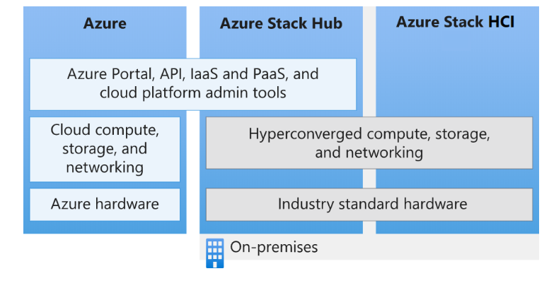
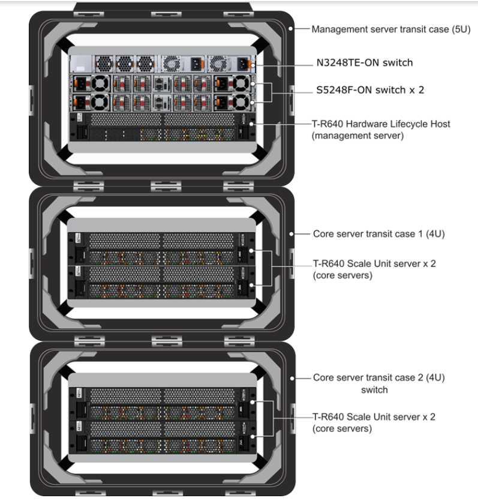
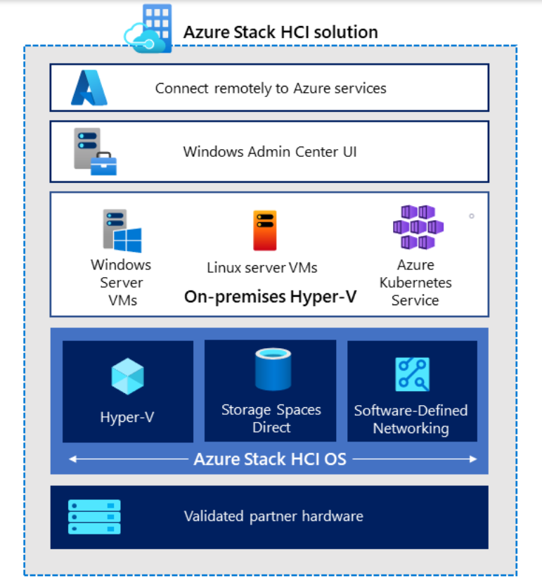
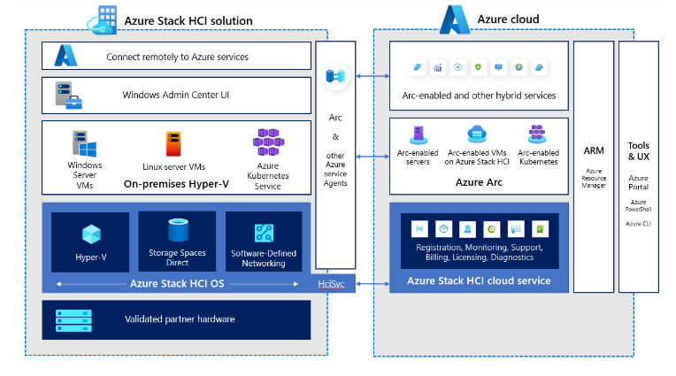

## Azure Stack

Azure Stack represents a significant breakthrough in cloud technology, offering a hybrid cloud platform that allows businesses to run Azure services within their own data center. This product is a miniaturized version of the public Azure, providing users with the power and flexibility of Azure's vast array of services but on their terms and timelines.

Azure Stack's design caters specifically to businesses that require the agility of cloud services but also need to keep some or all of their data on-premises for regulatory or operational reasons. It allows these organizations to enjoy the benefits of the cloud – such as scalability, speed, and cost-efficiency – while still complying with data sovereignty regulations and maintaining control over sensitive information.

## Azure Stack Hub vs Azure Stack HCI: What's the Difference?

Azure Stack comes in two forms: Azure Stack Hub and Azure Stack HCI (Hyper-Converged Infrastructure). While they share the 'Azure Stack' name and both provide Azure services on-premises, they have key differences.

**Azure Stack Hub** is an extension of Azure, bringing the agility and innovation of cloud computing to on-premises environments. It allows businesses to run Azure services in their own data center, providing a consistent hybrid cloud platform for building modern applications across on-premises and the public cloud.

Azure Stack Hub, as an extension of Azure, brings the agility and fast-paced innovation of cloud computing to on-premise infrastructures. One of its most notable strengths is its ability to provide a consistent environment that aligns with Azure's public cloud framework. This uniformity allows developers to build applications locally using Azure services and then deploy them seamlessly either on-premises or in the Azure public cloud, fostering a truly flexible and efficient development cycle. Interacting with the Azure Stack Hub portal looks nearly identical to operating in the Azure public cloud.

Moreover, Azure Stack Hub supports a wide range of Azure services, including Virtual Machines, Azure Functions, and Azure IoT Hub. This means businesses can leverage these cutting-edge tools and services in their own data center, enhancing their technological capabilities while maintaining necessary control over data and operations. Additionally, Azure Stack Hub operates on a pay-as-you-use model, offering financial flexibility by allowing businesses to only pay for the services they use.

**Azure Stack HCI** delivers a hyper-converged infrastructure solution for businesses to run virtual machines on-premises. It offers Azure's latest security, performance, and feature updates, allowing businesses to modernize their infrastructure while meeting stringent performance and latency requirements.

Azure Stack HCI is a testament to Microsoft's commitment to providing adaptable, high-performing cloud solutions. As a hyper-converged infrastructure solution, Azure Stack HCI combines storage, computing, and networking into a single system, reducing complexity and increasing scalability. This consolidation allows businesses to run virtualized applications on-premises while also taking advantage of Azure's cloud services.

**One of the most compelling features of Azure Stack HCI is its native integration with Azure Arc.** This allows businesses to manage their on-premises HCI deployments using the same Azure-based management tools they use for their cloud resources, bringing a unified, streamlined approach to resource management.

Azure Stack HCI supports Windows and Linux virtual machines, containers, and Kubernetes, providing a versatile platform for a broad range of workloads. It also comes with built-in security features, including Azure Security Center and Azure Sentinel, ensuring that your on-premises infrastructure benefits from Azure's advanced threat protection capabilities.

## Azure Arc

Azure Arc is a solution that extends Azure services and management to any infrastructure. Unlike Azure Stack, Azure Arc isn't about bringing Azure services to the edge or hybrid servers; instead, it projects edge and on-premises resources back into Azure.

Azure Arc acts as a bridge, connecting Azure's robust platform with various infrastructures. This allows you to operate applications and services across data centers, at the edge, and in multi-cloud environments while maintaining centralized control.

Suppose you're a cloud architect managing a hybrid environment that includes on-premises servers, edge locations, and multiple clouds. One of your key challenges could be implementing uniform governance and security policies across this diverse infrastructure. Azure Arc offers a solution by extending Azure's management capabilities to any infrastructure. With Azure Arc, you can apply Azure Policy to non-Azure Windows and Linux servers, enforcing compliance at scale and remediating configuration deviations automatically. You can also deploy Azure data services anywhere, enabling you to use the fully managed Azure SQL Database and Azure Database for PostgreSQL Hyperscale on any Kubernetes cluster. Therefore, Azure Arc helps to simplify complex and distributed environments, making Azure's management and security capabilities available everywhere.

## Summary

In summary, while Azure Stack and Azure Arc may sound similar on the surface, they serve different purposes and offer unique benefits. 

- Azure Stack brings an extension of Azure into your on-premises environment, allowing you to leverage Azure's capabilities while maintaining control over your data and infrastructure.
- On the other hand, Azure Arc brings your on-premises and multi-cloud resources into Azure, providing a unified, centralized management solution.