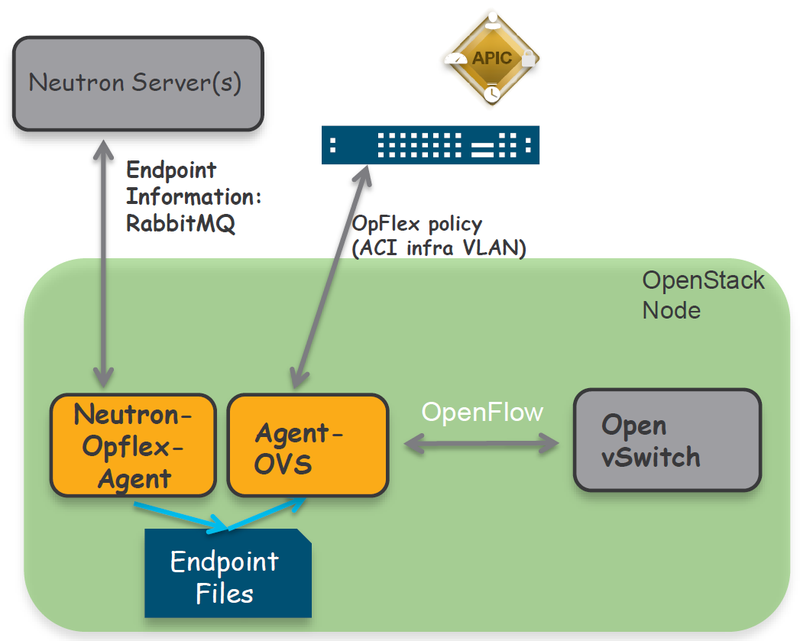

# OpFlex

- OpFlex is designed to allow a data exchange of a set of managed objects that are defined as part of an informational model.
- The protocol is designed to support XML and JSON (as well as the binary encoding used in some scenarios) and to use standard remote procedure call (RPC) mechanisms such as JSON-RPC over TCP. The use of a secure channel through Secure Sockets Layer (SSL) and Transport Layer Security (TLS) is also recommended.
- Cisco ACI delivers a best-of-breed leaf-spine topology with a single point of management. The Nexus 9000 Series family of switches offers nonblocking switching architectures with ideal connectivity options for OpenStack nodes.
    - These include 10GE, 40GE, or 100GE interfaces for Nova or storage nodes, 40GE, 100GE, or 400GE uplinks from the top of the rack switches and affordable 1GE interfaces for server management functions.
    - The OpenStack infrastructure requires connectivity for various services that run on dedicated EPGs on the Cisco ACI fabric, including Preboot Execution Environment (PXE), management, storage, etc.
    - Cisco APIC programmability is perfect to set up the fabric for an OpenStack environment, providing connectivity and security for all required services mapping EPGs through physical domains.

## Cisco ACI Unified Plug-in for OpenStack

- In addition to infrastructure connectivity services, OpenStack clouds also need to provide networking for tenant instances to communicate between themselves and external networks.
- Cisco offers a Cisco ACI OpenStack plug-in to perform these functions.
- The Cisco ACI OpenStack Neutron Plug-in is only supported with commercially supported OpenStack distributions.
- The plug-in can be deployed in two per-node configuration options that are not mutually exclusive:
    - OpFlex Mode (OpFlex-ovs):
        - In this option, Cisco APIC controls the upstream Open vSwitch (OVS) running on each Nova compute node by using the OpFlex protocol.
        - This requires installing Cisco OpFlex and OVS agents running on each of the compute nodes. This deployment option implements a virtual machine manager (VMM) on Cisco APIC to provide the fabric administrator maximum visibility of the OpenStack cloud.
        - When choosing the OpFlex mode, the Cisco ACI OpenStack Plug-in replaces the Neutron node datapath enabling fully distributed Layer 2, anycast gateway, DHCP, metadata optimization, distributed NAT, and floating IP enforcement.
        - OpFlex mode allows the creation of neutron networks based on
            - VLAN
            - VxLAN
        - Non-OpFlex Mode:
            - In this option, Cisco APIC only programs the physical fabric and treats OpenStack tenant traffic as part of physical domains (PhysDoms). This option can leverage SR-IOV or OVS-DPDK on the compute nodes and does not require installing Cisco agents on the nodes.
        - Regardless of the deployment model (OpFlex-ovs or non-OpFlex), integrating Cisco ACI with OpenStack by using the Cisco ACI OpenStack plug-in allows the creation of networking constructs in Cisco ACI to be driven from OpenStack using standard Neutron calls.
        - At the same time, the integration provides visibility within Cisco (APIC) down to the level of the individual VM instance. The Cisco ACI Integration Module (AIM) automatically enforces this policy synchronization.

## ACI ML2 Mechanism Driver

- When running the ACI integration, following Type and Mechanism Drivers will be used:
    - Type Drivers- OpFlex
    - Mechanism Drivers-apic_aim
        - APIC AIM mechanism driver enables the user to deploy OpenStack Projects in:
            - Neutron standard ML2 mode
            - Group Based Policy (GBP) model

## OpFlex Architecture

- Neutron-OpFlex-agent
    - It runs on both the compute and controller. It is responsible to communicate with the neutron server.
    - Receives updates from Neutron about new endpoints and updates EP and Service files.
- Agent-OVS
    - It runs on both the compute and controller. It is responsible to communicate with the OVS and the leaf node to register to ACI fabric.
    - Runs OpFlex protocol with ACI leaf proxy.

