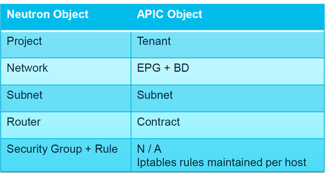
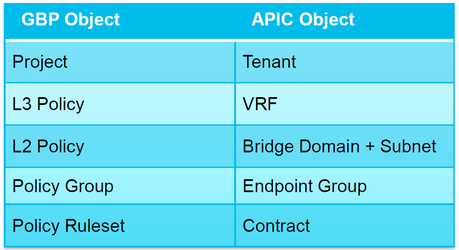

# History of ACI plugins for OpenStack

- In previous OpFlex plugin versions (referred to as Classical mode) it was necessary to decide at the time of deployment if the mode of the plugin will be Neutron/ML2 or GBP, and it was not possible to use both GBP and Neutron/ML2 APIs at the same time.
- Starting from OpFlex plugin version 2.2.1. It is possible to deploy the plugin in the “Unified” mode. In the unified mode, it is possible to create application topologies using either Neutron or GBP API.
-   Unified Plugin features are
        - IPv6
        - Multiple VMM Domain support
            - Allows a single OpenStack cluster to have multiple VMM Domains. Each VMM Domain can use an overlapping VLAN ranges. This allows the OpenStack cluster to scale to the fabric maximum EPGs without requiring VXLAN.
        - Key points to consider
            - Group-based Policy (GBP) and Modular Level 2 (ML2) Unified Mode does not have feature parity with the earlier non-unified mode.
            - GBP and ML2 Unified Mode support their coexistence on the same OpenStack/ACI Fabric but they need to be running on different VRF's.
            - GBP and ML2 Unified Mode is a new mode of operation. So, while there can be a manual transition to this mode of usage, there is no automated upgrade from the previous install to this mode.

## ML2 Plugin
- Network Centric
- Standard way of creating neutron networks.
- REST API will not change: any heat or CLI template will keep working
- Security Groups not visible in ACI: they are implemented by OS as OVS rules.
- All the operations are done on OpenStack through Horizon, CLI or Heat
- 

## GB2 Plugin
- Application Centric
- Introduces new REST APIs: if any existing templates, they need to be adapted to.
- Security Groups are created as ACI contracts and OVS rules. They are visible on ACI and enforced both in HW (ACI leaf) and SW(OVS).
- GBP offers much granularity and flexibility as compared to standard neutron.
- GBP comes with CLI, Heat and Horizon plugins.

## AIM (APIC Integration Manager)
- The AIM daemon is running on the controller nodes and is responsible to configure ACI through REST API call based on the OpenStack policy model defined.
    - APIC Integration Database and APIC Integration Manager (AIM) introduced as central point of storing plugin configuration.
    - AIM uses the OpenStack database.
    - AIM continuously synchronizes with APIC using APIC Integration Daemon (AID).
    - Group-Based Policies are mapped into Neutron API and then AIM. Neutron APIs are mapped to AIM directly.